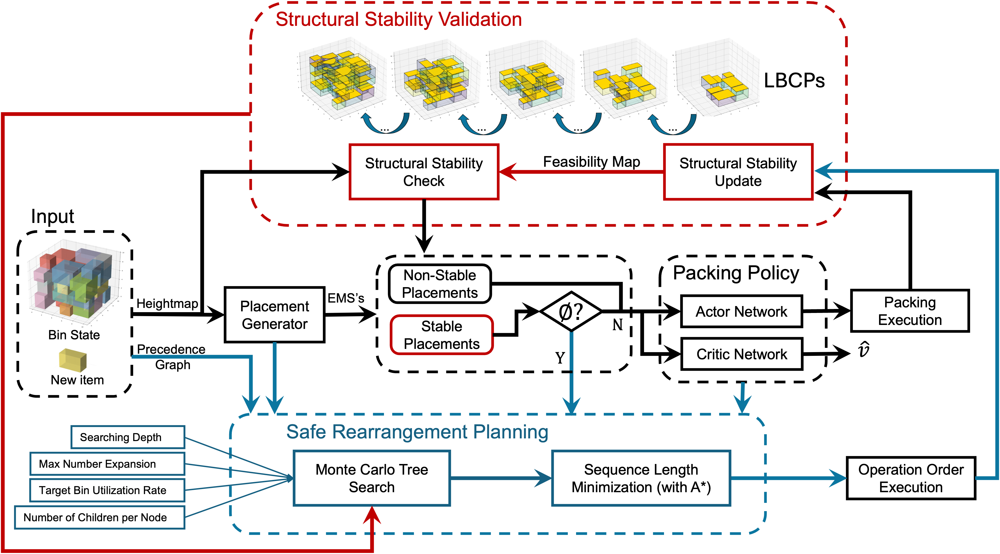

## Overview

This work proposes a novel framework that integrates packing policy with structural stability validation and heuristic planning to overcome limitations in online 3D bin packing. The method introduces Load Bearable Convex Polygon (LBCP) for computationally efficient stable loading positions, and Stable Rearrangement Planning (SRP) for safely reconfiguring the bin when new items cannot be placed directly.

## Framework

**Figure 1:** The proposed framework consists of three key modules: Structural Stability Validation, Packing Policy, and Safe Rearrangement Planning. Stability is ensured by the structural stability validation process, which identifies unstable placements based on the feasibility map. This validation is seamlessly integrated into both the packing policy and safe rearrangement planning modules to enforce stability constraints throughout. The packing policy module adopts an actor–critic framework, where the actor selects a loading position from candidates generated by the placement module, and the critic network estimates the expected bin utilization. If no stable placement is found, the safe rearrangement planning module generates a sequence of rearrangement actions on packed items to create space for an incoming item.

## Demonstration Videos

### Video 1: Physical Robot System Deployment
<iframe src="https://drive.google.com/file/d/1Uhnk7P-2geSftrlKKPW9NTe0NMLXweK1/preview" width="640" height="480" allow="autoplay"></iframe>

This video demonstrates the deployment of our packing system on a physical robotic platform. We used a 6-DOF robot arm with an RGB-D sensor mounted on its end-effector. The items are custom-made cardboard boxes in six distinct sizes. Each box is labeled with an Aruco marker, enabling the robot to estimate its pose and dimensions relative to the base frame. The packing process terminates when our Stable Rearrangement Planning (SRP) cannot find the operation sequence to accommodate the new item.

### Video 2: Stable Rearrangement Planning
<iframe src="https://drive.google.com/file/d/1N7vhnvhIHXhAKGoktYj1EzQf3IT7t46c/preview" width="640" height="480" allow="autoplay"></iframe>

This video demonstrates a random packing process on a real platform. Any loading operation verified as stable by our Load Bearable Convex Polygon (LBCP) method can ensure bin structural stability. The random stable loading experiment validates that our stability validation approach reliably prevents bin collapse during real-world robotic packing operations.
